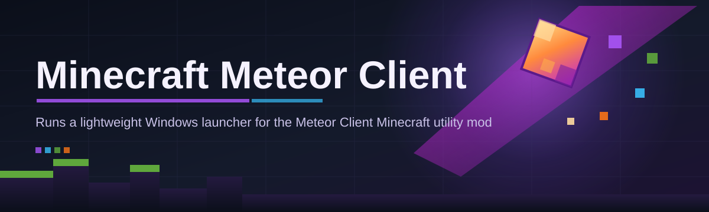
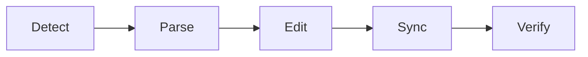

# minecraft-meteor-client-controller 🧭⚙️

  

*A control layer for Minecraft Meteor Client — one panel, every module, zero guesswork.*

  

---

## 🔭 Overview

Meteor Client reshaped how the sandbox-survival community interacts with Minecraft's client-side systems — modules, HUD overlays, movement utilities, combat assistance, and render tweaks bundled into a single framework. But raw module lists and config files don't scale well once you're juggling dozens of toggles across sessions, servers, and resolutions. **minecraft-meteor-client-controller** exists to sit on top of that experience as a dedicated management surface: a controller layer that organizes, profiles, and dispatches Meteor Client functionality without forcing you to memorize keybinds or dig through nested menus.

This project is built for players and server testers who treat their client setup like a workspace, not a toy. If you maintain multiple module profiles for different servers, switch between PvP and building contexts daily, or simply want a cleaner interface than the default in-game overlay, this controller gives you that layer of order. It's not a replacement for Meteor Client itself — it's the mission control desk sitting next to it.

Under the hood, the philosophy is stability first. Every release is validated against current Meteor Client builds, tested for Windows compatibility, and shipped as a standalone binary — no hidden background services, no telemetry, no dependency chains to babysit. Enterprise-grade reliability, hobbyist-grade simplicity.

## 🚀 Get the Controller

> [!TIP]
> The landing page always serves the current build. Bookmark it instead of any specific file path — versioned links rot, the landing page doesn't.

---

## 🧩 What It Actually Does

> [!NOTE]
> This is a controller and profile manager for Meteor Client workflows — it organizes, launches, and syncs configuration; it does not modify Minecraft's game files.

- **Profile switching, instantly** — Save distinct module loadouts per server or per activity (PvP, parkour, building) and swap between them in one click instead of re-toggling twenty modules.

- **Centralized module dashboard** — A single searchable list replaces scrolling through Meteor Client's in-game click-GUI, with categories, search, and favorites baked in.

- **HUD layout presets** — Store and recall exact overlay positions, scales, and color themes so your interface never drifts between sessions.

- **Keybind conflict detection** — Flags overlapping hotkeys before they cause a mid-game fumble, a small feature that saves real frustration.

- **Session logging** — Lightweight local logs of which modules were active and when, useful for reviewing your own setup history — not a surveillance layer, just a personal audit trail.

- **Config import/export** — Portable profile files you can carry between machines or share with teammates running the same Meteor Client version.

- **Update awareness** — Checks whether your local Meteor Client build lines up with the controller's expected module schema, and warns before mismatches cause silent failures.

- **Lightweight footprint** — Runs as a slim standalone process; it idles at near-zero CPU when not actively managing profiles.

---

## 🏁 How to Get Started

1. Visit the landing page via the download button above.

2. Grab the latest standalone build — no installer wizard, no bundled extras.

3. Run the executable; point it at your existing Meteor Client configuration folder on first launch.

4. Build your first profile, assign it a name, and toggle modules through the dashboard instead of the in-game menu.

> [!IMPORTANT]
> Keep your Meteor Client build itself updated separately. This controller manages configuration and profiles — it tracks compatibility but does not auto-patch the client.

---

## 🖥️ System Requirements

| Component | Requirement |
|---|---|
| OS | Windows 10 (64-bit) or Windows 11 |
| Runtime | Standalone — no external dependencies |
| Disk | ~120 MB free |
| RAM | 4 GB minimum, 8 GB recommended |
| Minecraft | Any version supported by your installed Meteor Client build |

  

---

## ⚙️ How It Works

The controller operates as a thin orchestration layer between you and your Meteor Client configuration files.

1. **Detect** — On launch, it locates your Meteor Client config directory.

2. **Parse** — Module and keybind data is read into an editable profile model.

3. **Edit** — You adjust modules, HUD layout, and bindings inside the dashboard.

4. **Sync** — Changes are written back to the configuration Meteor Client reads on next load.

5. **Verify** — A compatibility check confirms the schema still matches your client build.

---

## 🧯 Common Pitfalls

**Q: The controller launched but shows no modules.**
A: Point it at the correct Meteor Client config folder during first-run setup — a mismatched path is the usual culprit.

**Q: My keybinds reverted after switching profiles.**
A: Profiles are isolated by design. Re-save the profile after editing binds so the change persists.

**Q: Windows flagged the executable on first run.**
A: Standalone tools without a large-vendor code signature commonly trigger SmartScreen warnings. Verify the download source matches the official landing page before proceeding.

**Q: HUD layout looks stretched after a resolution change.**
A: Re-apply the saved HUD preset — layouts are stored per resolution profile, not dynamically rescaled.

**Q: Two profiles show conflicting keybinds.**
A: Use the built-in conflict detector under the keybind tab; it highlights overlaps before you save.

**Q: The compatibility check says "schema mismatch."**
A: Your Meteor Client build has likely updated its module structure. Update the controller to the latest release from the landing page.

---

## 🎛️ Interface & Controls

<strong>Keyboard shortcuts</strong>

| Action | Shortcut |
|---|---|
| Open dashboard | `Ctrl + Shift + M` |
| Quick profile switch | `Ctrl + Tab` |
| Search modules | `/` |
| Save current profile | `Ctrl + S` |
| Toggle HUD preview | `F9` |

<strong>Themes & appearance</strong>

- Dark, Light, and High-Contrast themes
- Custom accent color picker
- Scalable UI density (Compact / Comfortable)

> [!TIP]
> Compact density plus the High-Contrast theme is the most legible combo on smaller or high-DPI displays.

---

## 🤝 Contributing & Community

Contributions, issue reports, and profile-sharing templates are welcome. Open an issue for bugs, propose enhancements via pull request, and keep discussions focused on the controller layer — Meteor Client core development happens upstream.

> [!WARNING]
> This repository does not accept or endorse modifications intended to circumvent server anti-abuse systems. Keep contributions within the scope of configuration management and UI tooling.

---

## 📜 License

Released under the [MIT License](LICENSE), 2026.

---

## ⚠️ Disclaimer

This project is an independent, community-built controller for managing Minecraft Meteor Client configurations. It is not affiliated with, endorsed by, or officially connected to Mojang, Microsoft, or the Meteor Client development team. Use on multiplayer servers is subject to that server's own rules — check them before connecting.

